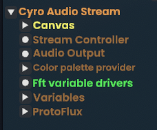

# 🔊🎶 Resonance: Observably Auricular entertainment!

Resonance is a mod for [Resonite](https://resonite.com) via [ResoniteModLoader](https://github.com/resonite-modding-group/ResoniteModLoader) that lets you visualize your audio streams with FFT! ([Fast-Fourier Transform](https://www.nti-audio.com/en/support/know-how/fast-fourier-transform-fft))

## How to use

If you're just looking for some pretty visuals, simply install the DLL and favorite the custom streamer I've crafted. It will automatically utilize Resonance and display a colorful mirrored spectrum of whatever audio you decide to stream! If you're a bit more savvy and are looking for how to utilize Resonance in your own visualizers, continue to the supplementary information below.

Custom audio stream link: `resrec:///U-Cyro/R-8DAFC317A0B346F7D152F1DE41D85EF7E774E239E1B6F196E340403D38267DC6`

**IMPORTANT**: Make sure that you stream your audio at full-volume in both hardware and software depending on what you're using! Otherwise the FFT will look small and quiet. Spotify's normalization can also throw off the amplitude of the graph as well, so it's recommended to have that disabled when streaming with Resonance.

## Supplementary Information

Once installed, Resonance will automatically add some new variables to your audio streams. Those appear in the form of a new slot under newly-spawned audio streams called "Fft variable drivers", you can see it highlighted below.



I don't recommend opening this slot in an inspector, as it has quite a few dynamic variables on it that carry the streams for each FFT bin.


### How to access bins

Fortunately you don't need to open this slot, as the variables are easily indexable up to the maximum number of bins which are displayed (Changeable in settings, defaults to 256).
Each bin can be indexed by reading a dynamic variable of type 'IValue\`1[System.Single]', with the variable name `fft_stream_bin_(num)` where `(num)` is replaced with the zero-indexed bin number you wish to access. E.g. `fft_stream_bin_17`.

This will give you a reference to the ValueStream itself. As of right now, you can't *directly* read these in protoflux, but you can slap them in a ValueDriver or anything else that takes an IValue\<float\>, and it'll be treated as any other float value. You may also be able to indirectly plug these into an indirect write node if you absolutely need to write the values (not recommended). The visualizer provided above demonstrates a succinct and clean way to utilize these streams efficiently should you need an example. As a small addendum, each FFT bin is streamed at a bit depth of 12 to conserve network bandwidth.

**DO NOTE HOWEVER** that the values of these bins have been modified significantly from the raw FFT data to look more visually appealing. If you were hoping to do any sort of scientific analysis or perform your own math to visualize the spectrum, you'll have to turn **off** normalization in your config. (If using [ResoniteModSettings](https://github.com/badhaloninja/ResoniteModSettings), enable the `showInternal` setting to show the normalization toggle)

The math I've used to equalize the bin contribution accross the graph is as follows for each bin:
```
frequency = (float)binIndex * sampleRate / fftWidth
gain = log10(frequency + 1)

decibels = 10 * log10(binMagnitude * binMagnitude)

normalizedDecibels = clamp((decibels + decibelNoiseFloor) / decibelNoiseFloor, 0, 1)

finalBinValue = normalizedDecibels * normalizedDecibels * gain
```

### How to access bands
8 frequency bands are also provided at full bit-depth (32 bits) with **no** modifications other than being squared so as to provide the energy instead of the raw bin magnitude. You can access them in the same manner as above with the variable name instead being `fft_stream_band_(num)`

Each band corresponds to the average energy of a certain frequency range of the FFT. Band zero being the average energy between 0-20hz, band one being the average between 21-60hz... etc.

The bands are as follows:

0) 0-20hz
1) 21-60hz
2) 61-250hz
3) 251-500hz
4) 501-2000hz
5) 2001-4000hz, 
6) 4001-6000hz, 
7) 6001-20000hz


These values may be quite small, which is why they're streamed at the full 32 bits. They won't look pretty, but they will remain untouched so that you as the developer can make them look pretty or use them for analysis reliably.

Hint: 10 * log10(energy) where 'energy' is the value from the band will give you the decibels ranging from -Infinity to zero. You can copy the "normalizedDecibels" math from above if you want to normalize this with a noise floor.


Several supplementary variables for miscellaneous information are also provided:

* `fft_stream_width`: Integer that provides the FFT width
* `fft_bin_size`: Integer that provides the amount of FFT bins actually displayed
* `fft_data_normalized`: Boolean that conveys whether the FFT stream is normalized with the equalization math above or not